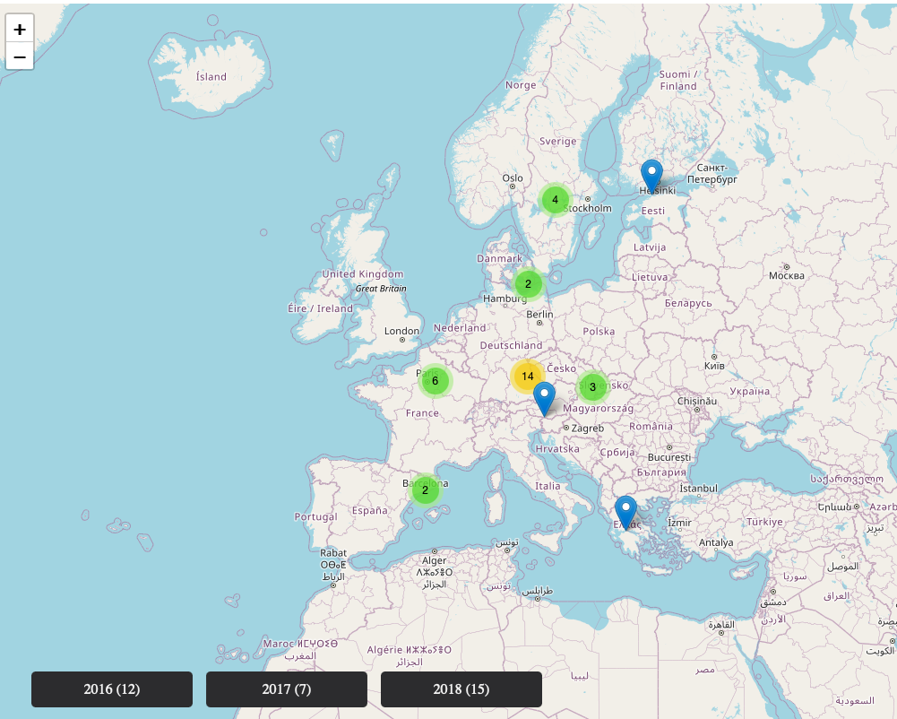

# Photo library

## Main goal (UseCase)
- When you have many photos in different subfolders, you can browse them all in one place, by GPS locations, also you can filter photos by dates
- Data are being saved from exif and gps data stored inside of photos files
- Photos (and created `idnex.html`) can be stored on external drive. May not work with symlinks
- Only `photo_index.db` and `index.html` are being created, nothing more. These hold only paths to original photos. The photos are not being copied, transfered or anything else 
- **<ins>UseCase</ins>**: When you have old photos stored on external drives, you can discover old forgotten moments by browsing all photos on the map.

### Supported extensions
- `.jpg`, `.jpeg`,`.png`, `.HEIC`, `.HEIF`

## How to use
1. Download `Structure Default` to some path in your computer. It can be any place, preferably for example Documents
2. In command line, run the `main.py` (write `python ` or `python3 ` + `path_to_file` (for example drag the `main.py` to command line))
    - for example
    ```bash
    python3 ~/Downloads/folder/main.py
    ```
3. For first use for every diferent set of subolders, choose to create New, then choose to Update
4. When you will be asked to choose the path, **choose the top folder above all subfolders containing photos**. All photos in all subdirectories and also in chosen folder will be indexed and then shown in given `index.html` file.
```bash
BASE FOLDER             #choose this folder as a place for two created files
├── Family
│   ├── Holidays 1
│   │   ├── photo1.jpg
│   │   └── photo2.jpg
│   ├── Holidays 2
│   │   ├── photo1.jpeg
│   │   └── photo2.jpeg
│   └── Trip to ...
│       ├── photo1.jpg
│       └── photo2.jpg
├── Personal
│   ├── A
│   │   ├── IMG1.HEIF
│   │   └── IMG345.HEIC
│   └── Nice
│       ├── IMG1.HEIF
│       ├── IMG345.HEIC
│       └── photo1.jpg
├── random
│   ├── IMG345.HEIC
│   ├── photo1.jpg
│   └── photo2.jpg
│
├── photo_index.db      #created in BASE FOLDER
└── index.html          #created in BASE FOLDER
```
5. Open `index.html` in your favorite browser and browse through photos

## Structure DEFAULT
can be saved anywhere on computer. After use can be deleted or moved somewhere else
- `main.py` - control script, which manages launching of `index_photos.py` and `create_html.py` and passes right path via `Explorer.py`
- `Explorer.py` - navigate to your desired location. `S` will return created path
```bash
______________________________
----Explorer-iteration:-1-----
/Users/user/Desktop/dbPhotos/folder         #current path
Q for quit; S for start; U for one level up #controling the script
folders: {1: 'subfolder'}                   #list of folders
1                                           #you choose a folder by number
```
- `photo_index_TEMPLATE.db` - template of database. `main.py` automatically copies it to chosen folder on new creation
- `index_TEMPLATE.html` - on new creation and every update, `index.html` is created from this template by parsing JSON data from `.db` file into itself
- `index_photos.py` - in given path, scan all photos in all subfolders, then scan exif and gps data and save them do .db database in parent folder
- `create_html.py` - from entries in database in given path, create `index.html` on the same path as database 

## Structure CREATED
must stay on created place (relative path to photos must stay the same)
- `photo_index.db` - database created from inexed photos
- `index.html` - html file, in which you will browse the photos
